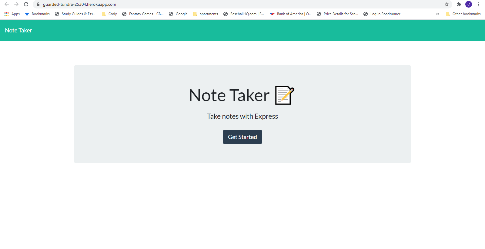
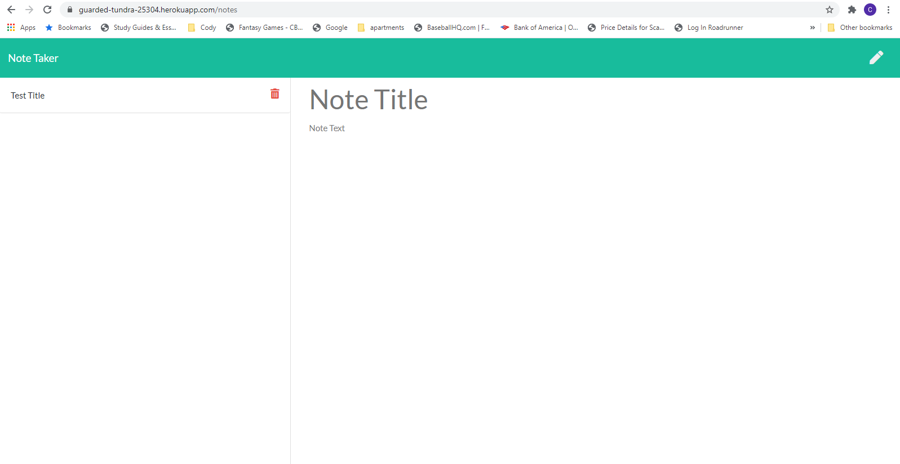

# Note Taker

## License

## Description

The Note Taker app is an easy way to create a to-do list, reminders or notes. It uses Node, Heroku (to deploy the app), the Express package and the UUID package. Once the user is visits the app on Heroku, they are able to write a new note and save it, where it will then appear on the left-hand side. They are also able to delete a note if needed.

## Installation

To use this app you must have a Heroku account, install Node/NPM, the Express package and the UUID package.

## Application

The live repository for this app is below:
https://github.com/codyregis6891/note-taker

The deployed app can be visited via the link below:
https://guarded-tundra-25304.herokuapp.com

Screenshots of the deployed app:

## Questions?

Contact me: codyregis6891@yahoo.com